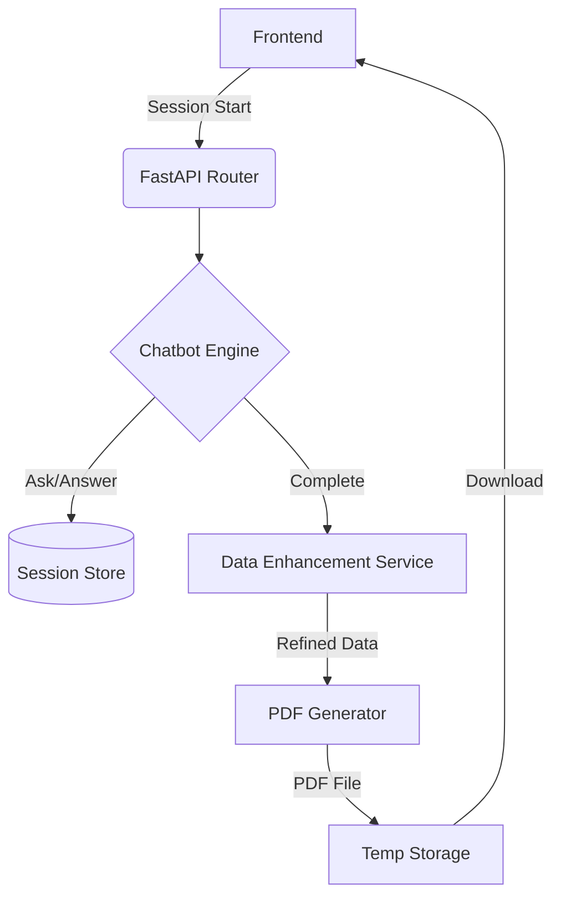

# 🚀 Quick Resume - Backend

[](https://fastapi.tiangolo.com/)
[](https://www.python.org/)
[](https://www.reportlab.com/)

A powerful, FastAPI-based backend service designed to generate professional resumes through an interactive chatbot interface. This system uses a rule-based engine to collect user information and generates high-quality PDF resumes using ReportLab.

---

## 📖 Table of Contents
- [Features](#-features)
- [Architecture](#-architecture)
- [Tech Stack](#-tech-stack)
- [API Documentation](#-api-documentation)
- [Getting Started](#-getting-started)
- [Project Structure](#-project-structure)
- [Developed By](#-developed-by)

---

## ✨ Features

- 🤖 **Interactive Chatbot Engine**: A structured, rule-based flow to collect personal details, experience, skills, and projects.
- 📄 **Dynamic PDF Generation**: High-quality resume creation using `ReportLab` with ATS-friendly templates.
- ⚡ **Data Enhancement**: Automated professional summary generation and description refinement.
- 🔗 **RESTful API**: Clean, versioned endpoints for seamless integration.
- 🛡️ **Pydantic Validation**: Robust data validation and error handling.
- 🌐 **CORS Ready**: Configurable origins for frontend integration.

---

## 🏗️ Architecture



---

## 🛠️ Tech Stack

| Technology | Purpose |
|------------|---------|
| **FastAPI** | High-performance Web Framework |
| **ReportLab** | PDF Document Generation |
| **Pydantic** | Data Validation & Settings |
| **Uvicorn** | ASGI Server |
| **Python-Dotenv** | Environment Management |

---

## 📡 API Documentation

### Base URL: `http://localhost:8000/resume`

#### 1. Start Session
- **Method:** `POST /start`
- **Response:**
  ```json
  {
    "session_id": "uuid-string",
    "first_question": "What is your full name?"
  }
  ```

#### 2. Get Current Question
- **Method:** `GET /question?session_id={id}`
- **Response:**
  ```json
  "Please provide your email address."
  ```

#### 3. Submit Answer
- **Method:** `POST /answer?session_id={id}&answer={text}`
- **Response:**
  ```json
  {
    "message": "Answer received",
    "next_question": "What is your phone number?",
    "is_completed": false
  }
  ```

#### 4. Generate & Download
- **Method:** `POST /generate?session_id={id}` -> Triggers generation.
- **Method:** `GET /download?session_id={id}` -> Returns PDF file.

#### 5. Direct PDF Generation
- **Method:** `POST /direct-generate`
- **Body:** `ResumeData` JSON object.
- **Response:** Returns PDF file directly.

---

## 🚀 Getting Started

### Prerequisites
- Python 3.9 or higher
- pip

### Installation & Setup

1. **Clone the repo:**
   ```bash
   git clone <repository-url>
   cd AI_RESUME_GENERATOR_BACKEND
   ```

2. **Setup Virtual Environment:**
   ```bash
   python -m venv venv
   # Windows
   .\venv\Scripts\activate
   # Linux/macOS
   source venv/bin/activate
   ```

3. **Install Dependencies:**
   ```bash
   pip install -r requirements.txt
   ```

4. **Environment Configuration:**
   Create a `.env` file:
   ```env
   PORT=8000
   HOST=0.0.0.0
   CORS_ORIGINS=http://localhost:3000
   ```

5. **Run the Server:**
   ```bash
   uvicorn app.main:app --reload
   ```

---

## 📂 Project Structure

```text
app/
├── chatbot/       # Rule-based logic and session management
├── models/        # Pydantic schemas for data validation
├── pdf/           # ReportLab PDF generation templates
├── routes/        # API route definitions
├── services/      # Data enhancement and summary generation
├── templates/     # HTML/Text templates (if any)
├── utils/         # Helper functions
├── validators/    # Custom input validation logic
└── main.py        # Application entry point
```

---

## 👨‍💻 Developed By

**Yashwant Rangrej**
- [GitHub](https://github.com/Yashwant-Rangrej)
- [LinkedIn](https://www.linkedin.com/in/yashwant-rangrej-0856993a8/)